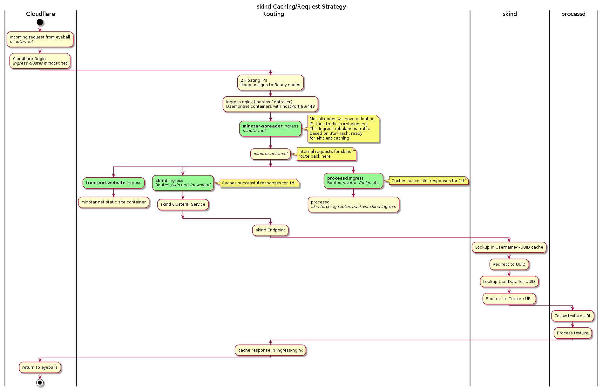

# Minotar Infra

* Caching by Cloudflare
* Kubernetes on DigitalOcean
* Caching by Nginx
* Golang backend



## Prerequisites

A few tools are needed:
* Terraform
* `doctl`
* `kubectl`
* `helm`

A DigitalOcean Access Token is needed, add this to your env at `DIGITALOCEAN_ACCESS_TOKEN` so the Terraform provider picks it up

## Terraform

Optionally set the region in the `.tfvars` file. On first run, init Terraform with `make terraform-init`.

Further run cluster creation/updates with `make terraform-apply`.

## Ansible

The monitoring node (outside of Kubernetes) is managed by Ansible.

Deploy with `make ansible-deploy` and verify configuration is correct with `make ansible-check`

## Kubernetes

While terraform has the kubeconfig, it's easiest to just use `doctl` (as you should already have it)

```
doctl kubernetes cluster kubeconfig save minotar-k8s
```

Create the required namespaces:
```
make k8-namespaces
```

Once metrics-server is installed (under #Monitoring), you can use `make k8-top` to see at a glance cpu/memory stats.


## Helm

Set your extra mcclient vars `helm/mcclient-values.yaml`


Add required repos:
```
make helm-repos
```

### Monitoring

Metrics server (eg. for `kubectl top nodes` and `kubectl top pods`) is installed with `make helm-metrics-install`. Later upgrades via `make helm-metrics-upgrade`.

Prometheus stack is installed with `make helm-prometheus-install` (this can take a little while) and upgraded via `make helm-prometheus-upgrade`

### Floating IP

Create the token which will be used to assign the floating IPs to the nodes.
```
kubectl -n flipop create secret generic flipop-provider-tokens --from-literal=DIGITALOCEAN_ACCESS_TOKEN="${DIGITALOCEAN_ACCESS_TOKEN}"
```

Installed with `make helm-flipop-install` and upgraded with `helm-flipop-upgrade`

### Ingress

Install nginx-ingress with `make helm-ingress-install` and subsequently upgrade with `make helm-ingress-upgrade`.

### App

* Minotar website via Nginx: `make helm-website-install` and `make helm-website-upgrade`

* Nginx Texture cache: `make helm-texture-install` and `make helm-texture-upgrade`

* skind: `make helm-skind-install` and `make helm-skind-upgrade`

* Frontend Varnish / "mittwald-httpcache": `make helm-varnish-install` and `make helm-varnish-upgrade`


* processd: `make helm-processd-install` and `make helm-processd-upgrade`

